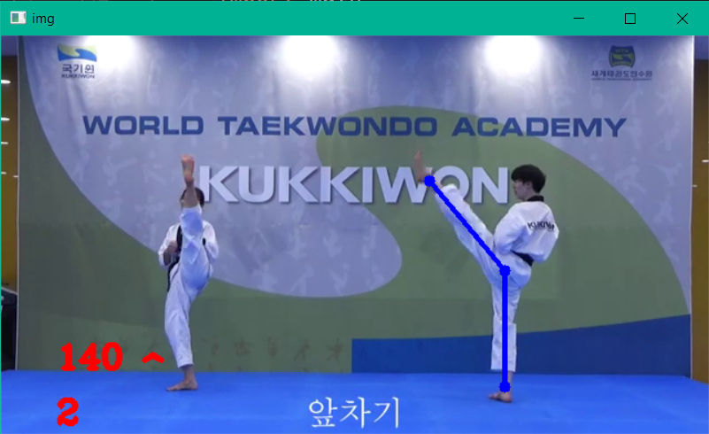

## Body processing project with MediaPipe

---

Taekwondo kicks research project.
in this project used pose estimation from Mediapipe.

Project features:
* Determining the size of the taekwondo foot angle.
* Counting Taekwondo kicks.
* Checking the correctness of Taekwondo kicks.
* Ability to process from webcam or video.
* , ....

## Libraries used in the project:

---

* Mediapipe: for body processing and detection
* OpenCV: for reading and processing video or camera

